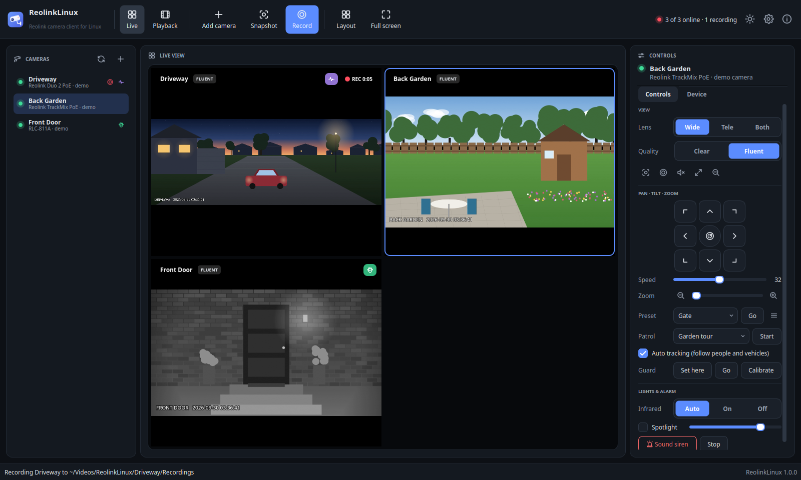
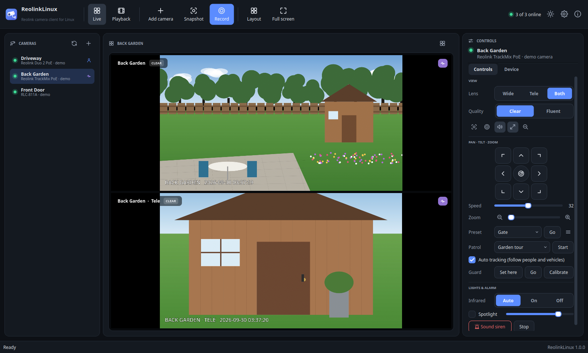
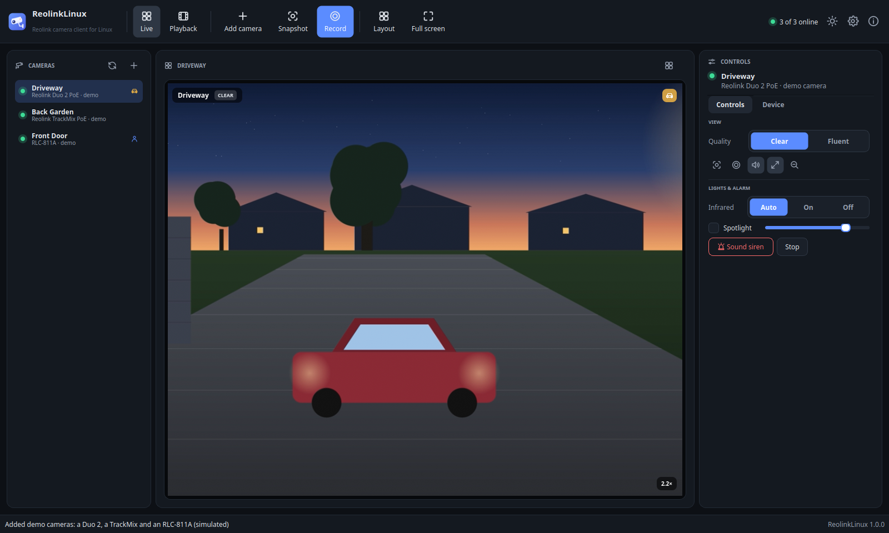
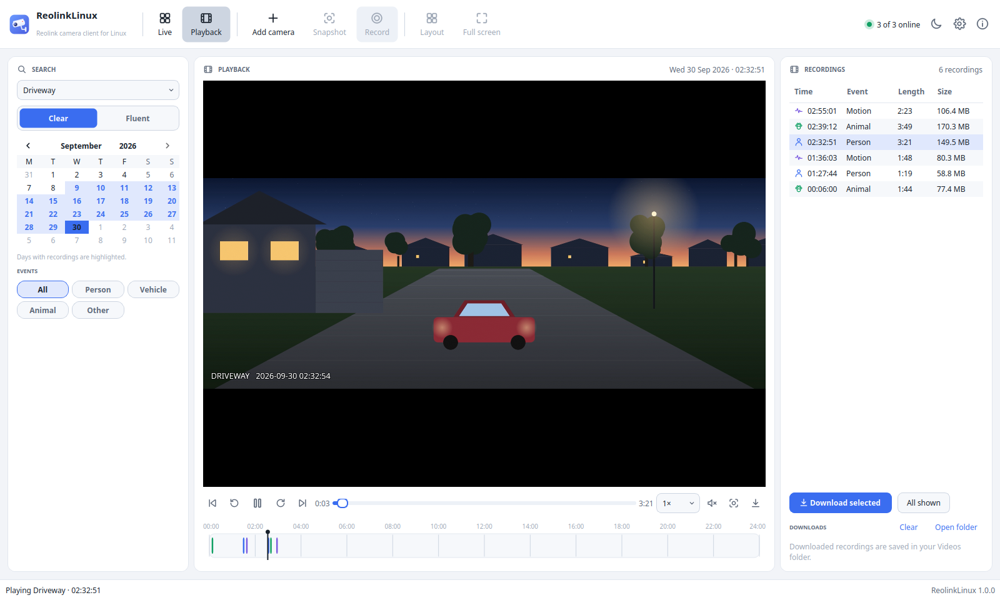
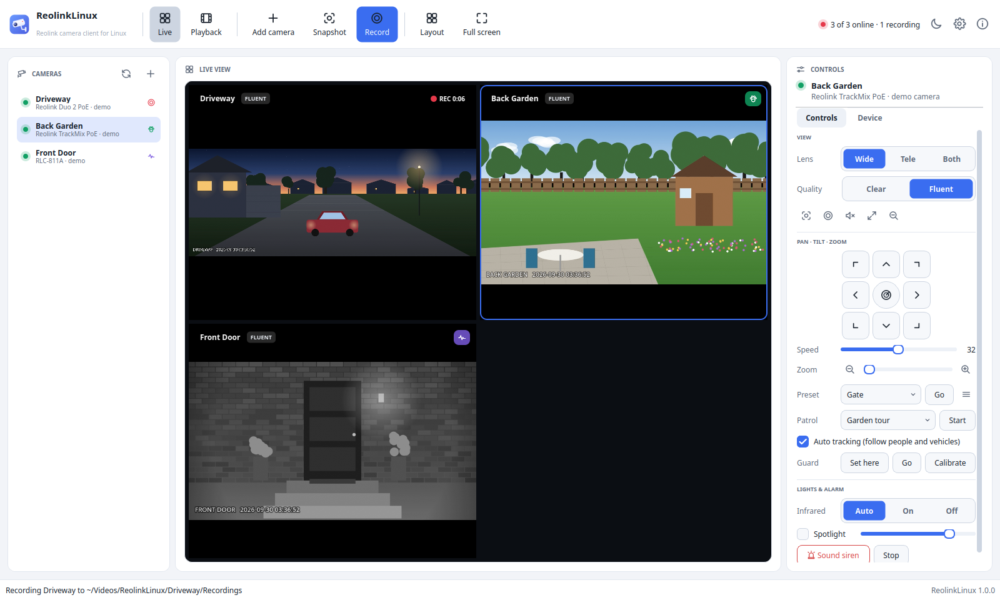

# ReolinkLinux: a Reolink camera client for Linux

ReolinkLinux is a native desktop app for **Reolink PoE cameras, NVRs and Home Hubs**. It
shows your cameras in **full quality**, controls **pan, tilt and zoom**, plays back and
downloads the **recordings on the SD card or NVR**, and **records to your PC**. It is built
for Arch Linux and runs on any modern distribution, on X11 and Wayland.

It was designed around the **Duo 2 PoE** (4608 × 1728 stitched panorama) and the
**TrackMix PoE** (wide + telephoto lenses, PTZ and auto tracking), and works with the rest of
Reolink's line-up that has the standard HTTP(S) and RTSP interfaces.



> ReolinkLinux is an independent project. It is not affiliated with, or endorsed by, Reolink.

## Features

**Live view**
- **Full quality**: the "Clear" main stream at the camera's native resolution (4K, the Duo 2's
  4608 × 1728, 16 MP…) in H.264 or H.265, with **hardware decoding** (VA-API on Intel/AMD,
  NVDEC on NVIDIA) through mpv. The grid uses the light "Fluent" stream, and a camera switches to
  Clear when you enlarge it (both choices are in Settings, and per camera in the Controls panel).
- A **grid** of all cameras that picks the best layout, or fixed 1 / 2×2 / 3×3 / 4×4 layouts
  with pages. **Double-click** a camera to enlarge it, and use **full screen** (F11).
- **Digital zoom and pan**: scroll on any video to zoom in up to 8× around the mouse pointer, and
  drag to move around. Great for reading plates and faces on the Duo 2's wide panorama.
- **Dual-lens cameras**: the TrackMix's wide and telephoto lenses are shown **side by side** when
  enlarged, or one at a time (Wide / Tele / Both). Original Duo cameras appear as two channels.
- **Live detection badges** for person, vehicle, animal and motion events, on the video and in the
  camera list.
- **Low latency** playback, sound on the enlarged camera, and **automatic
  reconnection** when a camera reboots or the network drops.

**Control**
- **PTZ pad**: hold a direction to move and release to stop, with adjustable speed. The keyboard
  arrow keys and `+`/`-` work too.
- Optical **zoom** and **focus** (step buttons and sliders), and **auto focus**.
- **Presets**: go to, save the current position as, and delete presets. Plus **patrols**,
  **auto scan**, the **guard (home) position** and PTZ **calibration**.
- **Auto tracking** on/off (TrackMix and other tracking cameras).
- **Infrared** LEDs (Auto / On / Off), **spotlight** on/off with brightness, and the **siren**.
- Device details: model, firmware, hardware, MAC, UID, SD card use, ports, stream resolutions and
  live decoder statistics, plus **clock sync**, the camera's **web interface** and **reboot**.

**Playback and downloads**
- A **calendar** that highlights the days with recordings, and a **24-hour timeline** colour-coded
  by event (person, vehicle, animal, motion). Click anywhere on it to play from that moment,
  scroll to zoom and drag to scroll.
- A **recording list** with event filters, play/pause, ±10 s, previous/next clip, speed from 0.5×
  to 16×, and frame snapshots.
- **Download** one, several or all recordings of a day to your PC, with a progress queue. Works for
  the Clear and Fluent recordings, the TrackMix telephoto lens, and NVR channels.

**Save footage to your PC**
- **Snapshots**: full-resolution JPEGs taken by the camera itself.
- **Record** any camera live with one click. The stream is copied as-is (no re-encoding, no quality
  loss) to MP4 or MKV.
- **Continuous recording** (NVR-style) per camera while the app runs, split into files of a chosen
  length and deleted automatically after a chosen number of days.

**Everything else**
- **Finds cameras** on your network by itself (ONVIF discovery and a Reolink port scan), and has a
  **Test connection** button.
- **NVRs and Home Hubs**: add the recorder once and all of its cameras appear.
- Passwords are kept in your **desktop keyring** (GNOME Keyring / KWallet) when available. The app
  talks to cameras over HTTPS by default.
- **Dark and light themes** that follow your desktop, in the same design as
  [EZP2019Linux](https://github.com/oreo1298/EZP2019Linux) and
  [FirmwareLab](https://github.com/oreo1298/FirmwareLab).
- **Demo mode** with three simulated cameras, so you can try everything without hardware.
- A **command-line tool**, `reolinkctl`, for scripts and cron jobs.

| TrackMix: both lenses and PTZ | Duo 2: 2.2× digital zoom into the panorama |
|---|---|
|  |  |

| Playback with the event timeline (light theme) | Grid (light theme) |
|---|---|
|  |  |

## Supported cameras

ReolinkLinux uses Reolink's HTTP(S) API for control and RTSP for video, the same interfaces
the Reolink web client and Home Assistant use. It works with any Reolink camera, NVR or Home
Hub that has them:

| Type | Examples |
|---|---|
| Dual-lens | **Duo 2 PoE**, Duo 3 PoE, Duo PoE (as two channels), **TrackMix PoE / WiFi** |
| PTZ and zoom | RLC-823A, RLC-823S1, E1 Zoom / E1 Outdoor, RLC-811A, RLC-511WA |
| Fixed PoE | RLC-510A, RLC-520A, RLC-810A, RLC-820A, RLC-1212A, RLC-1224A, CX410 / CX810 ColorX, Doorbell PoE… |
| Recorders | RLN8-410, RLN16-410, RLN36 NVRs, Home Hub / Home Hub Pro (including the battery cameras paired to them) |

The app reads each camera's abilities and only shows the controls it supports. Battery and
4G cameras (Argus, Go, …) have no HTTP or RTSP of their own; add them through a Home Hub or
NVR.

## Before you start: turn on HTTPS and RTSP on the camera

New Reolink firmware ships with some network services switched off. In the **Reolink app** (or
Reolink Client), open the camera's **Settings → Network → Advanced → Server Settings** (called
*Port Settings* on some models) and turn on:

- **HTTPS** (or HTTP), which ReolinkLinux uses for control, playback and downloads.
- **RTSP**, which carries the live video.
- **RTMP** (optional), only needed for the FLV stream mode in Settings.

For an NVR, do this on the NVR itself. A dedicated user account for ReolinkLinux is a good
idea; it needs no admin rights to view, but PTZ, lights and clock changes need an admin or a
user with those permissions.

## Installation

ReolinkLinux needs **Python 3.10+**, **PySide6** (Qt 6), the **mpv library** (`libmpv`) for
video and **FFmpeg** for recording. Follow the section for your distribution.

### Arch Linux, CachyOS, EndeavourOS, Manjaro, Garuda and other Arch-based distributions

The repository includes a PKGBUILD, so the app installs as a normal pacman package, with its
menu entry and icon:

```bash
sudo pacman -S --needed git base-devel
git clone https://github.com/oreo1298/ReolinkLinux.git
cd ReolinkLinux
makepkg -si
```

Recommended extras: `sudo pacman -S --needed python-keyring` (store passwords in the keyring)
and your GPU's video-decoding driver: `intel-media-driver` (Intel since 2015),
`libva-intel-driver` (older Intel) or `libva-mesa-driver` (AMD). NVIDIA's proprietary driver
includes NVDEC.

To update later: `cd ReolinkLinux && git pull && makepkg -sif`.

### Fedora

```bash
sudo dnf install git python3-pyside6 mpv-libs ffmpeg-free python3-keyring
git clone https://github.com/oreo1298/ReolinkLinux.git
cd ReolinkLinux
./packaging/install.sh
```

Fedora's own FFmpeg leaves out the **H.265** decoder that 4K cameras such as the Duo 2 and
TrackMix use for their Clear stream. Enable [RPM Fusion](https://rpmfusion.org/Configuration)
and switch to the full FFmpeg:

```bash
sudo dnf swap ffmpeg-free ffmpeg --allowerasing
```

### Debian 13, Ubuntu 25.04 and newer

```bash
sudo apt install git python3-venv python3-pyside6.qtwidgets python3-pyside6.qtopenglwidgets \
     python3-pyside6.qtsvg libmpv2 ffmpeg python3-keyring
git clone https://github.com/oreo1298/ReolinkLinux.git
cd ReolinkLinux
./packaging/install.sh
```

### Ubuntu 22.04 / 24.04, Linux Mint 21 / 22, Pop!_OS, Zorin OS, elementary OS, Debian 12

These releases don't package PySide6, so the installer downloads it (PySide6-Essentials,
about 100 MB) into ReolinkLinux's own folder. Nothing else on your system changes.

```bash
sudo apt install git python3-venv libmpv2 ffmpeg libxcb-cursor0     # Ubuntu 22.04 / Mint 21: libmpv1
git clone https://github.com/oreo1298/ReolinkLinux.git
cd ReolinkLinux
./packaging/install.sh
```

### openSUSE Tumbleweed

```bash
sudo zypper install git python3-pyside6 libmpv2 ffmpeg-7 python3-keyring
git clone https://github.com/oreo1298/ReolinkLinux.git
cd ReolinkLinux
./packaging/install.sh
```

For H.265 (4K Clear streams), install the full codecs from
[Packman](https://en.opensuse.org/Additional_package_repositories#Packman).

### Any other distribution

Install `git`, Python 3.10+ with `venv`, the mpv library (`libmpv.so`) and `ffmpeg` with your
package manager, then run `./packaging/install.sh` as above. If your distribution has no
PySide6, the installer gets it from PyPI.

### What the installer does

`packaging/install.sh` installs **for your user only** (no root): the app goes into
`~/.local/lib/reolinklinux`, the `reolinklinux` and `reolinkctl` commands into `~/.local/bin`, and
a menu entry and icon into `~/.local/share`. `make uninstall` (or
`./packaging/uninstall.sh`) removes it again and keeps your settings. To install somewhere else,
set `PREFIX`, for example `PREFIX=/opt/reolinklinux sudo -E ./packaging/install.sh`.

### Try it without installing

```bash
./reolinklinux.sh --demo       # with the simulated cameras
./reolinklinux.sh              # normal start
```

## Getting started

1. Start **ReolinkLinux** from your application menu.
2. Click **Add camera**, then **Search the network**, and pick your camera, or type its IP address.
   Your router's device list shows it too.
3. Enter the user name (usually `admin`) and password, click **Test connection**, then **Add
   camera**.
4. Repeat for your other cameras. For an **NVR or Home Hub**, add the recorder once and all of its
   cameras appear.

Not ready to connect a camera? Click **Try demo cameras** to get three simulated cameras: a Duo 2,
a TrackMix and an RLC-811A.

### Live view

| Action | How |
|---|---|
| Select a camera | Click its video or its name in the list |
| Enlarge / back to the grid | Double-click the video, press `F`, or `Esc` to return |
| Digital zoom | Mouse wheel on the video; drag to pan; *Reset zoom* in the Controls panel |
| Stream quality | *Clear* / *Fluent* in the Controls panel, or right-click the video |
| TrackMix lenses | *Wide* / *Tele* / *Both* in the Controls panel |
| Sound | Speaker button, or `M` |
| Grid layout | *Layout* in the toolbar (Automatic, 1, 2×2, 3×3, 4×4; fill or fit) |
| Full screen | `F11` or *Full screen*; `Esc` to leave |
| More options | Right-click a video or a camera in the list |

### PTZ

Hold a direction on the pad (or an arrow key) to move, and release to stop. The **centre
button** starts an auto scan; press it again to stop. **Zoom** and **Focus** move in steps while
held, or jump to a position with the slider. **Presets** go to a saved position. To save the
current view, open the ☰ menu next to the list and choose *Save current position as preset…*.
**Patrol**, **Auto tracking** and **Guard** (the home position the camera returns to) are below.

### Playback

Open **Playback** (Ctrl+2) and choose the camera. Highlighted days in the calendar have
recordings. Click a recording in the list, or anywhere on the timeline, to play it. Filter by
event with the chips. **Download selected** or **All shown** saves the files to your PC; the
**Downloads** list shows progress and has *Open folder*.

### Where files are saved

| What | Folder |
|---|---|
| Snapshots | `~/Pictures/ReolinkLinux/<camera>/` |
| Manual recordings | `~/Videos/ReolinkLinux/<camera>/Recordings/` |
| Continuous recordings | `~/Videos/ReolinkLinux/<camera>/Continuous/` |
| Downloads from the SD card / NVR | `~/Videos/ReolinkLinux/<camera>/SD card/` |

The folders follow your desktop's Pictures and Videos folders, and you can change them in
**Settings → Recording**. Continuous recording is switched on per camera, in *Edit camera* or
from the camera's right-click menu.

### Keyboard shortcuts

| Key | Action |
|---|---|
| `Ctrl+1` / `Ctrl+2` | Live view / Playback |
| `Ctrl+N` | Add a camera |
| `Ctrl+S` | Snapshot of the selected camera |
| `Ctrl+R` | Start / stop recording the selected camera |
| `F` | Enlarge the selected camera / back to the grid |
| `M` | Sound on / off |
| `F11`, `Esc` | Full screen, leave full screen or the enlarged view |
| Arrow keys, `+`, `-` | Pan, tilt and zoom a PTZ camera (hold) |
| `Space`, `←`, `→` | Playback: pause, back / forward 5 s |
| `Ctrl+,` | Settings |

## Command line

`reolinkctl` uses the cameras saved in the app (`-c NAME`), or any camera with `--host`:

```bash
reolinkctl list                                   # saved cameras
reolinkctl discover                               # find cameras on the network
reolinkctl -c Driveway info                       # model, firmware, features, stream URLs
reolinkctl -c Garden snapshot -o garden.jpg       # full-resolution picture
reolinkctl -c Garden snapshot --tele              # …from the TrackMix telephoto lens
reolinkctl -c Garden ptz left --duration 1        # pan left for one second
reolinkctl -c Garden preset goto Gate
reolinkctl -c Garden track off                    # auto tracking off
reolinkctl -c Driveway light spotlight on --brightness 80
reolinkctl -c Driveway recordings --date 2026-09-30
reolinkctl -c Driveway download --date 2026-09-30 --all -o ~/Videos/driveway
reolinkctl -c Driveway record --duration 600      # ten minutes to ./Driveway_<time>.mp4
reolinkctl -c Driveway stream-url                 # RTSP URL for VLC, mpv, Frigate…
reolinkctl --host 192.168.1.50 --user admin info  # a camera that isn't saved (asks for the password)
```

`reolinkctl --help` and `reolinkctl COMMAND --help` list every option.

## Troubleshooting

- **"Could not reach the Reolink API"**: HTTPS/HTTP is switched off on the camera (see
  [Before you start](#before-you-start-turn-on-https-and-rtsp-on-the-camera)), or the address is
  wrong. Check that the camera answers `ping`.
- **The camera connects but the video says "Connection refused" or stays black**: RTSP is
  switched off on the camera.
- **"The camera locked logins"**: too many wrong passwords. The camera accepts logins again after
  a few minutes.
- **The 4K / Clear stream stutters or uses a lot of CPU**: open the **Device** tab; the
  *Decoder* line should say *hardware*. Install your GPU's VA-API driver (see Installation). On
  Fedora and openSUSE, install the full FFmpeg for H.265. On a slow computer, use Fluent in the
  grid (the default), or turn off *Low latency* in Settings → Video.
- **Video is black in a virtual machine**: ReolinkLinux detects software OpenGL (llvmpipe) and
  switches mpv to its simple renderer. Set `REOLINKLINUX_SIMPLE_RENDERER=1` to force it on any
  other system that shows black or wrongly coloured video.
- **Recording is greyed out or fails**: install `ffmpeg`.
- **Passwords with `&`, `#` or `%`**: fine for everything except the optional FLV stream mode,
  where the camera cannot read them.
- **Settings** are stored in `~/.config/reolinklinux/config.json`. Passwords go to the keyring
  when `python-keyring` is installed; otherwise they are kept in that file, which only your user
  can read.

## How it works

- `reolinklinux/core/`: camera logic, standard library only. It contains the HTTP API client
  (`api.py`), device, capability and stream handling (`device.py`), RTSP URL probing with digest
  authentication (`rtsp.py`), recordings and event flags (`recordings.py`), FFmpeg recording
  (`recorder.py`), discovery (`discovery.py`), settings (`config.py`) and the demo cameras
  (`demo.py`).
- `reolinklinux/gui/`: the PySide6 app. Video is a small ctypes binding to libmpv's OpenGL render
  API (`mpv.py`) drawn into Qt widgets (`video.py`), so it works the same on X11 and Wayland.
- `reolinklinux/cli.py`: `reolinkctl`.

The live stream is RTSP over TCP. The URL is found by asking the camera (`GetRtspUrl`) and checking
the candidates with an RTSP `DESCRIBE`, because different firmware generations name their streams
differently. The TrackMix telephoto lens is the `Preview_01_autotrack` stream. Recordings are played
through the camera's `Playback`/`Download` commands, with FLV as a fallback.

## Development

```bash
python -m venv --system-site-packages .venv && . .venv/bin/activate
pip install -e ".[dev]"
make test        # the suite runs against a simulated camera (HTTP API + RTSP server)
make lint
make demo
```

## License

MIT; see [LICENSE](LICENSE). See [NOTICE](NOTICE) for credits: the reverse-engineering work of
the [reolink_aio](https://github.com/starkillerOG/reolink_aio) project was an invaluable
reference for the Reolink API.
